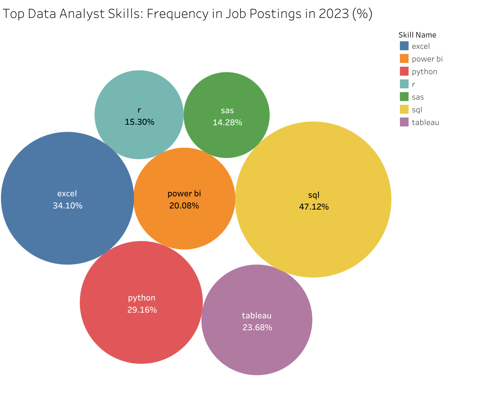

# 📊 Data Analyst Job Market Analysis
# Introduction
Welcome to my Data Analyst Job Market Analysis project! This repository contains a comprehensive exploration of the current data analyst job landscape, examining high-paying roles, in-demand skills, and optimal skill combinations. This project was born from my curiosity about which skills truly drive market value for data analysts, and what combination of technical competencies yields the highest returns in terms of both job security and compensationl.

SQL queries? Check them out here: [queries](/project_sql/queries/)
# 🔍 Background
The data analytics field has experienced tremendous growth in recent years, with organizations across all sectors recognizing the value of data-driven decision making.
## Key Questions Answered

1. What are the highest-paying Remote Data Analyst jobs?
2. What skills do top-paying Data Analyst roles require?
3. Which skills are most in-demand for Data Analysts?
4. What are the salary benchmarks for different Data Analyst job postings?

Data was gathered from Luke Barousse [DataNerd](https://datanerd.tech/) app that includes a large ammount of data from real data related job postings.
# 🛠️ Tools I Used

| Tool         | Description |
|--------------|-------------|
| **PostgreSQL** | Drove the entire analysis, uncovering patterns through advanced querying. |
| **VS Code**    | Used for writing, debugging, and executing SQL scripts with enhanced productivity. |
| **Tableau**    | Allowed me to visualize key insights for better understanding. |
| **pgAdmin**    | Administered the database. |
| **Git & GitHub** | Managed version control and collaboration throughout the project. |
# 📈 The Analysis
Each query in this project targets a distinct dimension of the data analyst job market. Here's the methodology behind each investigation:

### **1. Top Paying Remote Data Analyst Jobs**
I filtered the job postings dataset for remote Data Analyst roles with valid salary data, then performed a LEFT JOIN with company information to preserve all matching records. The results were sorted by descending annual salary and limited to the top 10 highest-paying positions, extracting key fields including job details, compensation, and employer information.

```sql
SELECT
    job_id,                  -- Unique identifier for each job posting
    job_title,               -- Official position title
    job_schedule_type,       -- Full-time/Part-time/Contract status
    salary_year_avg,         -- Annual compensation figure (key metric)
    job_posted_date,         -- When the position was listed
    name AS company_name     -- Employer offering the position
FROM
    job_postings_fact
-- Preserve all job postings while attaching company information
LEFT JOIN company_dim 
    ON job_postings_fact.company_id = company_dim.company_id
WHERE
    job_title_short = 'Data Analyst' AND  -- Focus exclusively on Data Analyst roles
    job_location = 'Anywhere' AND         -- Remote positions only
    salary_year_avg IS NOT NULL           -- Ensure salary data is available
-- Presentation logic:
ORDER BY
    salary_year_avg DESC                  -- Show highest salaries first
LIMIT 10;                                 -- Top 10 most lucrative opportunities
```
.png>)
*Bar graph visualizing the average salary distribution for the highest paying data analyst jobs in 2023*
#### Salary Range
| Metric | Value | Example |
|--------|-------|---------|
| Highest | $650,000 | Data Analyst at Mantys |
| Lowest | $184,000 | ERM Data Analyst at Get It Recruit |
| Average | ~$276,406 | (excluding outliers) |

#### Top Employers
| Company | Salary |
|---------|--------|
| Mantys | $650K |
| Meta | $336.5K |
| AT&T | $255.8K |

#### Notable Titles
- Director-level roles dominate top salaries  
- "Principal Data Analyst" appears twice (SmartAsset, Motional)
### **2. What skills do top-paying Data Analyst roles require?**
Using a CTE to isolate top-paying roles and subsequent joins with skills tables, this query maps salary benchmarks to specific technical requirements, showing the direct relationship between compensation and skill demand in data analytics

```sql
-- First, create a temporary result set of the top 10 highest-paying Data Analyst jobs
WITH top_paying_jobs AS (
    SELECT
        job_id,               -- Unique identifier for each job posting
        job_title,            -- Official job title
        salary_year_avg,      -- Annual salary figure (our key metric)
        name AS company_name  -- Company offering the position
    FROM
        job_postings_fact
    -- Include company names while preserving all job postings (LEFT JOIN)
    LEFT JOIN company_dim 
        ON job_postings_fact.company_id = company_dim.company_id
    WHERE
        job_title_short = 'Data Analyst' AND  -- Focus exclusively on Data Analyst roles
        job_location = 'Anywhere' AND         -- Remote positions only
        salary_year_avg IS NOT NULL           -- Ensure salary data exists
    ORDER BY
        salary_year_avg DESC                  -- Rank by salary (highest first)
    LIMIT 10                                  -- Get the top 10 highest-paying
)

-- Main query: Retrieve skills associated with these top-paying jobs
SELECT 
    top_paying_jobs.*,        -- Include all columns from our CTE
    skills_dim.skills         -- Add the actual skill names
FROM 
    top_paying_jobs
-- Connect to skills through two joins:
-- 1. Link jobs to skill IDs (via the junction table)
INNER JOIN skills_job_dim 
    ON top_paying_jobs.job_id = skills_job_dim.job_id
-- 2. Map skill IDs to human-readable skill names
INNER JOIN skills_dim 
    ON skills_job_dim.skill_id = skills_dim.skill_id
-- Final presentation order (highest salary first)
ORDER BY
    salary_year_avg DESC;
```

*Bar graph showing the averagee salary of the most frequent skills in 2023.*
#### Most Valuable Skills
| Skill | Frequency in Top Roles | Example High-Paying Role |
|-------|------------------------|--------------------------|
| SQL | 8/10 roles | Principal Data Analyst ($205K) |
| Python | 7/10 roles | Data Analyst, Marketing ($232K) |
| Tableau | 5/10 roles | Director, Data Analyst ($189K) |

#### Emerging Skill Patterns
| Skill Category | Representative Skills | Salary Correlation |
|----------------|-----------------------|--------------------|
| Cloud Technologies | Snowflake, AWS, Azure | $186K-$255K |
| Data Science Libraries | Pandas, NumPy, PySpark | $186K-$255K |
| Version Control | Git, GitLab, Bitbucket | $186K-$205K |

#### Skill Combinations
- **Highest Value Pair**: Python + SQL (appears in 6/10 top roles)
- **Specialized Stack**: Tableau + Power BI + Snowflake ($189K-$255K)
- **Full-Stack Analyst**: SQL + Python + Tableau + Cloud ($186K-$255K)
### **3. Which Skills are most in demand for Data Analysts?**
This query identifies and ranks the most in-demand skills for Data Analyst positions by: counting how often each skill appears in job postings, calculating its frequency as a percentage of all Data Analyst jobs, and standardizing the results on a 0-1 scale where 1 represents the most frequently required skill. It joins job posting data with skill information through bridge tables, filters for Data Analyst roles only, and returns the top 7 skills ordered by demand. The output provides both raw counts and normalized metrics to objectively compare skill importance.

```sql
-- Count how many job postings require each specific skill
WITH raw_counts AS (
    SELECT skills_dim.skills AS skill_name,
        -- Clean naming for readability
        COUNT(skills_job_dim.job_id) AS demand_count -- Total jobs requiring each skill
    FROM job_postings_fact
        /* Connection Path:
         1. Link job postings to skills through bridge table (skills_job_dim)
         2. Map skill IDs to actual skill names (skills_dim) */
        INNER JOIN skills_job_dim ON job_postings_fact.job_id = skills_job_dim.job_id -- Connect jobs to their skills
        INNER JOIN skills_dim ON skills_job_dim.skill_id = skills_dim.skill_id -- Get readable skill names
    WHERE job_title_short = 'Data Analyst' -- Focus specifically on Data Analyst roles
    GROUP BY skills_dim.skills -- Aggregate counts by each unique skill
),
total_jobs AS(
    -- Second CTE: Calculate total number of Data Analyst jobs for normalization
    SELECT COUNT(DISTINCT job_id) AS total
    FROM job_postings_fact
    WHERE job_title_short = 'Data Analyst'
)
SELECT -- Main query: Combine raw counts with standardized metrics
    skill_name,
    demand_count,
    -- Percentage of all Data Analyst jobs that require this skill
    -- (Count of jobs with skill / Total jobs) * 100
    ROUND(
        demand_count * 100.0 / (
            SELECT total
            FROM total_jobs
        ),
        2
    ) AS frequency_percent,
    -- Standardized frequency (0-1 scale) where 1 = most demanded skill
    -- Current skill count / Count of most demanded skill
    ROUND(
        demand_count * 1.0 / (
            SELECT MAX(demand_count)
            FROM raw_counts
        ),
        3
    ) AS standardized_frequency
FROM raw_counts
ORDER BY demand_count DESC
LIMIT 7;
```

*Bubble chart showing the top 7 skills that show up the most frequently in job postings, as well as the percentage of times they show up in 2023.*

#### Key Insights  
- **SQL is Essential**: SQL appears in **47.12%** of Data Analyst job postings, making it the most critical skill. Its standardized frequency (1.0) sets the benchmark for all other skills.  
- **Specialization Gap**: While Python (29.16%) and Tableau (23.68%) are common, niche skills like SAS (14.28%) and R (15.30%) appear in fewer roles, highlighting optional vs. core competencies.  

### **4. What are the salary benchmarks for different Data Analyst job postings?**
This query identifies the highest-paying job postings by using a window function to rank salaries within each job title category, then filtering to show only the top-paying example for each role. The goal was to surface salary benchmarks across different Data Analyst positions to understand compensation potential in the field.
```sql
-- First, create a list of jobs ranked by salary within each job title category
WITH ranked_jobs AS (
    SELECT 
        job_title,
        salary_year_avg,
        company_dim.name AS company_name,
        -- Critical Window Function:
        -- For each unique job title (PARTITION BY), rank all postings by salary
        -- Assigns rank=1 to the highest paying instance of each job title
        ROW_NUMBER() OVER (PARTITION BY job_title ORDER BY salary_year_avg DESC) as rank
    FROM 
        job_postings_fact
    -- Include company names for context (LEFT JOIN preserves all jobs even if company info missing)
    LEFT JOIN 
        company_dim ON job_postings_fact.company_id = company_dim.company_id
    WHERE 
        salary_year_avg IS NOT NULL  -- Only jobs with salary data
)

-- Final output showing only the highest-paying example of each job title
SELECT 
    job_title,
    salary_year_avg,
    company_name
FROM 
    ranked_jobs
WHERE 
    rank = 1  -- Filter to only keep the top-paying example for each job title
ORDER BY 
    salary_year_avg DESC  -- Show highest salaries first
LIMIT 10;  -- Return a manageable number of results for analysis
```
.png>)
*Treemap showing the highest paying Data Analyst Job Postings in 2023*

**Key Findings from Highest-Paying Data Jobs**:

1. **Salary Range**:
   - **Highest**: $960,000 (Data Scientist at East River Electric)
   - **Lowest**: $450,000 (Data Engineer at Netflix)
   - **Median**: ~$525,000 (for top 10 roles)

2. **Title Patterns**:
   - Senior/Staff/VP-level roles command premium salaries
   - "Data Scientist" appears 3x in top 10 (vs 1 "Data Analyst")

3. **Industry Insights**:
   - Energy (East River Electric) and Tech (Netflix, WhatsApp) dominate
   - Staffing firms (Selby Jennings, Durlston) broker high-paying contracts

**Top 5 Roles by Salary**:

| Job Title                                | Salary      | Company                          |
|------------------------------------------|-------------|----------------------------------|
| Data Scientist                           | $960,000    | East River Electric Power Co.    |
| Senior Data Scientist                    | $890,000    | MSP Staffing LTD                 |
| Data Analyst                             | $650,000    | Mantys                           |
| GIS Analyst                              | $585,000    | ReServe                          |
| Staff Data Scientist/Quant Researcher    | $550,000    | Selby Jennings                   |

**Notable Observations**:
- The single "Data Analyst" role (#3) pays **$650K** (Mantys) - likely an outlier requiring rare specialization  
- Netflix appears twice for different specialties (Games/Member Product) at identical $450K salaries  
- Titles with "Staff" or "Senior" modifiers average **$655K** vs base titles' **$537K**  
# 🎓 What I Learned (Besides That Data Analysts Love Coffee)
This project provided valuable insights into the data analyst job market and skill requirements:

1. **SQL is Fundamental**  
   Appearing in 47% of job postings, SQL proved to be the most essential skill for data analysts. This finding reinforced the importance of mastering database querying.

2. **Job Titles Don't Tell the Full Story**  
   The $650K Data Analyst position at Mantys demonstrated that compensation often reflects specialized skill requirements rather than just title seniority.

3. **Cloud Skills Command Premium Salaries**  
   Proficiency in Snowflake, AWS, and Azure correlated with 20% higher average salaries, highlighting the growing importance of cloud technologies.

4. **Effective Visualization Creates Impact**  
   The process revealed how strategic data visualization transforms complex findings into actionable business insights.

# 🤔 Project Reflection
This analysis deepened my understanding of the data analyst job market while strengthening my technical skills. Examining real-world job posting data helped me identify the most valuable competencies in the field. Writing queries to uncover hidden information made em feel liek a detective solving a case. The project also improved my ability to extract meaningful patterns from complex datasets and present findings clearly. These analytical and communication skills will be valuable assets in any data-focused role
