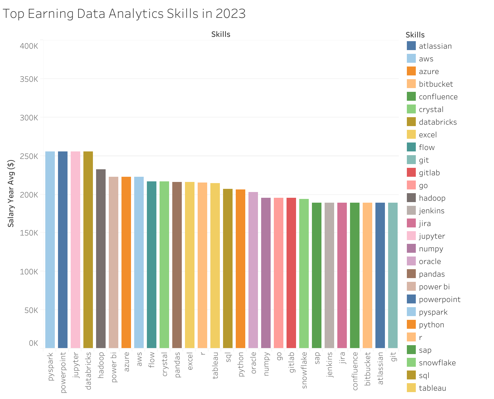

# 📊 Data Analyst Job Market Analysis
# Introduction
Welcome to my Data Analyst Job Market Analysis project! This repository contains a comprehensive exploration of the current data analyst job landscape, examining high-paying roles, in-demand skills, and optimal skill combinations. This project was born from my curiosity about which skills truly drive market value for data analysts, and what combination of technical competencies yields the highest returns in terms of both job security and compensationl.

SQL queries? Check them out here: [queries](/project_sql/queries/)
# 🔍 Background
The data analytics field has experienced tremendous growth in recent years, with organizations across all sectors recognizing the value of data-driven decision making.
## Key Questions Answered

1. What are the highest-paying Remote Data Analyst jobs?
2. What skills do top-paying Data Analyst roles require?
3. Which skills are most in-demand for Data Analysts?
4. Which skills correlate with the highest salaries?
5. What skills offer both high demand and high salary potential?
6. What are the salary benchmarks for different Data Analyst roles?

Data was gathered from Luke Barousse [DataNerd](https://datanerd.tech/) app that includes a large ammount of data from real data related job postings.
# 🛠️ Tools I Used

| Tool         | Description |
|--------------|-------------|
| **PostgreSQL** | Drove the entire analysis, uncovering patterns through advanced querying. |
| **VS Code**    | Used for writing, debugging, and executing SQL scripts with enhanced productivity. |
| **Tableau**    | Allowed me to visualize key insights for better understanding. |
| **pgAdmin**    | Administered the database. |
| **Git & GitHub** | Managed version control and collaboration throughout the project. |
# The Analysis
Each query in this project targets a distinct dimension of the data analyst job market. Here's the methodology behind each investigation:

### 1. Top Paying Remote Data Analyst Jobs
I filtered the job postings dataset for remote Data Analyst roles with valid salary data, then performed a LEFT JOIN with company information to preserve all matching records. The results were sorted by descending annual salary and limited to the top 10 highest-paying positions, extracting key fields including job details, compensation, and employer information.

```sql
SELECT
    job_id,                  -- Unique identifier for each job posting
    job_title,               -- Official position title
    job_schedule_type,       -- Full-time/Part-time/Contract status
    salary_year_avg,         -- Annual compensation figure (key metric)
    job_posted_date,         -- When the position was listed
    name AS company_name     -- Employer offering the position
FROM
    job_postings_fact
-- Preserve all job postings while attaching company information
LEFT JOIN company_dim 
    ON job_postings_fact.company_id = company_dim.company_id
WHERE
    job_title_short = 'Data Analyst' AND  -- Focus exclusively on Data Analyst roles
    job_location = 'Anywhere' AND         -- Remote positions only
    salary_year_avg IS NOT NULL           -- Ensure salary data is available
-- Presentation logic:
ORDER BY
    salary_year_avg DESC                  -- Show highest salaries first
LIMIT 10;                                 -- Top 10 most lucrative opportunities
```
.png>)
*Bar graph visualizing the average salary distribution for the highest paying data analyst jobs in 2023*
#### Salary Range
| Metric | Value | Example |
|--------|-------|---------|
| Highest | $650,000 | Data Analyst at Mantys |
| Lowest | $184,000 | ERM Data Analyst at Get It Recruit |
| Average | ~$276,406 | (excluding outliers) |

#### Top Employers
| Company | Salary |
|---------|--------|
| Mantys | $650K |
| Meta | $336.5K |
| AT&T | $255.8K |

#### Notable Titles
- Director-level roles dominate top salaries  
- "Principal Data Analyst" appears twice (SmartAsset, Motional)
### 2. What skills do top-paying Data Analyst roles require?
Using a CTE to isolate top-paying roles and subsequent joins with skills tables, this query maps salary benchmarks to specific technical requirements, showing the direct relationship between compensation and skill demand in data analytics

```sql
-- First, create a temporary result set of the top 10 highest-paying Data Analyst jobs
WITH top_paying_jobs AS (
    SELECT
        job_id,               -- Unique identifier for each job posting
        job_title,            -- Official job title
        salary_year_avg,      -- Annual salary figure (our key metric)
        name AS company_name  -- Company offering the position
    FROM
        job_postings_fact
    -- Include company names while preserving all job postings (LEFT JOIN)
    LEFT JOIN company_dim 
        ON job_postings_fact.company_id = company_dim.company_id
    WHERE
        job_title_short = 'Data Analyst' AND  -- Focus exclusively on Data Analyst roles
        job_location = 'Anywhere' AND         -- Remote positions only
        salary_year_avg IS NOT NULL           -- Ensure salary data exists
    ORDER BY
        salary_year_avg DESC                  -- Rank by salary (highest first)
    LIMIT 10                                  -- Get the top 10 highest-paying
)

-- Main query: Retrieve skills associated with these top-paying jobs
SELECT 
    top_paying_jobs.*,        -- Include all columns from our CTE
    skills_dim.skills         -- Add the actual skill names
FROM 
    top_paying_jobs
-- Connect to skills through two joins:
-- 1. Link jobs to skill IDs (via the junction table)
INNER JOIN skills_job_dim 
    ON top_paying_jobs.job_id = skills_job_dim.job_id
-- 2. Map skill IDs to human-readable skill names
INNER JOIN skills_dim 
    ON skills_job_dim.skill_id = skills_dim.skill_id
-- Final presentation order (highest salary first)
ORDER BY
    salary_year_avg DESC;
```

*Bar graph showing the averagee salary of the most frequent skills in 2023.*
#### Most Valuable Skills
| Skill | Frequency in Top Roles | Example High-Paying Role |
|-------|------------------------|--------------------------|
| SQL | 8/10 roles | Principal Data Analyst ($205K) |
| Python | 7/10 roles | Data Analyst, Marketing ($232K) |
| Tableau | 5/10 roles | Director, Data Analyst ($189K) |

#### Emerging Skill Patterns
| Skill Category | Representative Skills | Salary Correlation |
|----------------|-----------------------|--------------------|
| Cloud Technologies | Snowflake, AWS, Azure | $186K-$255K |
| Data Science Libraries | Pandas, NumPy, PySpark | $186K-$255K |
| Version Control | Git, GitLab, Bitbucket | $186K-$205K |

#### Skill Combinations
- **Highest Value Pair**: Python + SQL (appears in 6/10 top roles)
- **Specialized Stack**: Tableau + Power BI + Snowflake ($189K-$255K)
- **Full-Stack Analyst**: SQL + Python + Tableau + Cloud ($186K-$255K)

# What I Learned
# Conclusion
